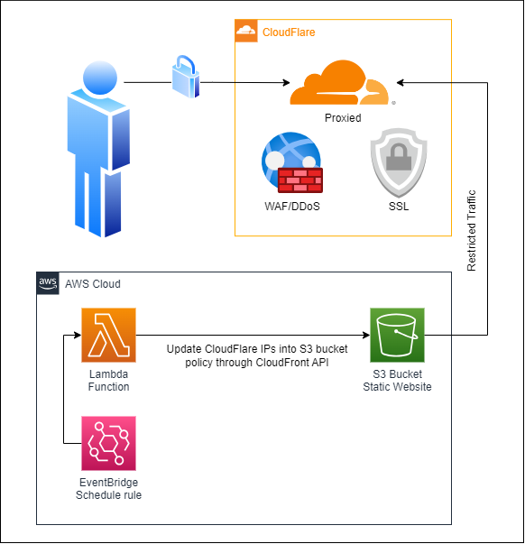

# Connecting CloudFlare to S3 Bucket

## **Purpose**
The purpose of this project is to **provision an S3 bucket** used for hosting a website. The website is configured to **only allow connections from CloudFlare IP addresses**. This is achieved using a **Lambda Function** that collects IPs from the CloudFlare API and updates the S3 bucket policy accordingly.

## **Requires**
Before starting, ensure you have the following prerequisites installed and configured:
- **Terraform**: Install Terraform on your local machine. You can download it from the [official website](https://www.terraform.io/downloads.html).

- **AWS CLI (Version 2)**: Install the AWS Command Line Interface (CLI) version 2 on your local machine. You can download it from the [official website](https://aws.amazon.com/cli/).

- **AWS Configuration**: Configure your AWS credentials using the `aws configure` command to set up your AWS Access Key ID, Secret Access Key, default region, and output format. Make sure your AWS CLI is properly authenticated.

## **Instructions**
1. The **source folder** contains the website's source code.

2. Use the `setup.sh` bash script to **provision the necessary AWS resources**.

3. Use the `clean.sh` bash script to **destroy the AWS resources**.

## **Configuration Variables**
Here are the variables that can be configured in the `main.tf` file:

| **Name**                       | **Description**                                                                                       | **Default Value**                    | **Type**    | **Required** |
|--------------------------------|-------------------------------------------------------------------------------------------------------|--------------------------------------|-------------|--------------|
| `profile`                      | **AWS named profile** to use for authentication. This profile should be configured in your AWS CLI or SDK credentials file. | "default" | **string**  | **No**       |
| `bucket_name`                  | **Name of the S3 bucket**                                                                             | `N/A`                                 | **string**  | **`Yes`**      |
| `region`                       | **AWS region** where the S3 bucket will be created                                                     | `N/A`                                 | **string**  | **`Yes`**      |
| `index_document`               | **The name of the index document** for the S3 website                                                 | "index.html"                     | **string**  | **No**       |
| `error_document`               | **The name of the error document** for the S3 website                                                 | "error/index.html"               | **string**  | **No**       |
| `versioning_status`            | **Enable or disable versioning** for the S3 bucket                                                     | "Disabled"                       | **string**  | **No**       |
| `object_ownership_rule`        | **The object ownership setting** for the S3 bucket                                                     | "BucketOwnerPreferred"           | **string**  | **No**       |
| `block_public_acls_status`     | **Block public ACLs** for the S3 bucket                                                                | false                            | **bool**    | **No**       |
| `block_public_policy_status`   | **Block public bucket policies** for the S3 bucket                                                      | false                            | **bool**    | **No**       |
| `ignore_public_acls_status`    | **Ignore public ACLs** for the S3 bucket                                                               | false                            | **bool**    | **No**       |
| `restrict_public_buckets_status` | **Restrict public access** to the S3 bucket                                                           | false                            | **bool**    | **No**       |
| `bucket_acl_status`            | **The ACL (Access Control List)** for the S3 bucket                                                     | "private"                        | **string**  | **No**       |
| `lambda_function_name`         | **Name of the Lambda function**                                                                       | "UpdateCloudFlareIPsToS3Policy"   | **string**  | **No**       |
| `lambda_function_description`   | **Description of the Lambda function**                                                                | "This Lambda function, named update-cloudflare-ips-to-s3-policy, is responsible for periodically updating the access policy of an Amazon S3 bucket to grant public read access to objects within the bucket based on CloudFlare's IP address ranges." | **string**  | **No**       |
| `lambda_function_role`         | **Name of the IAM role** associated with the Lambda function                                           | "UpdateCloudFlareIPsToS3Policy-Role" | **string**  | **No**       |
| `lambda_function_role_policy_name` | **Name of the IAM policy** attached to the Lambda function's role                                  | "UpdateCloudFlareIPsToS3Policy-Role-Policy" | **string**  | **No**       |

## **License**
This static website is based on the Dimension template by [HTML5 UP](https://html5up.net/).

### **Creative Commons License**
All of the site templates I create for [HTML5 UP](https://html5up.net/) are licensed under the **Creative Commons Attribution 3.0 License**, which means you can:
 - Use them for personal stuff
 - Use them for commercial stuff
 - Change them however you like

...all for free, yo. In exchange, just give HTML5 UP credit for the design and tell your friends about it =)

More info [here](https://html5up.net/license).
